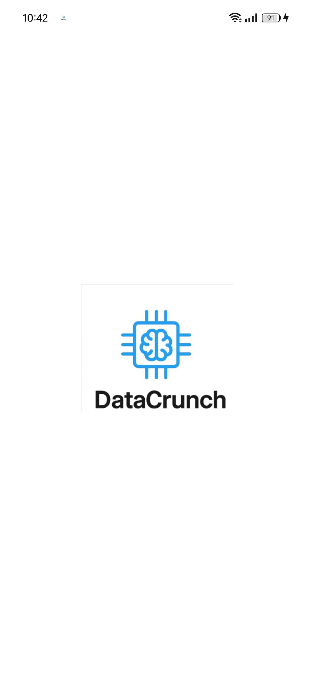
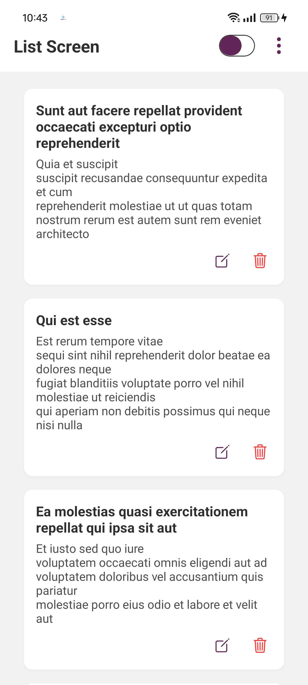
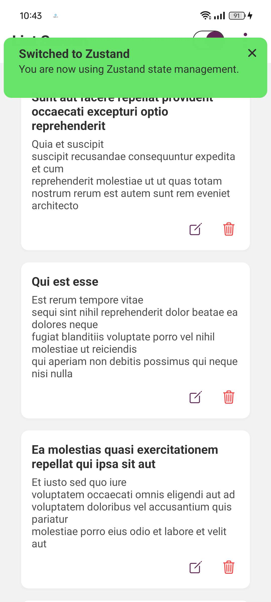
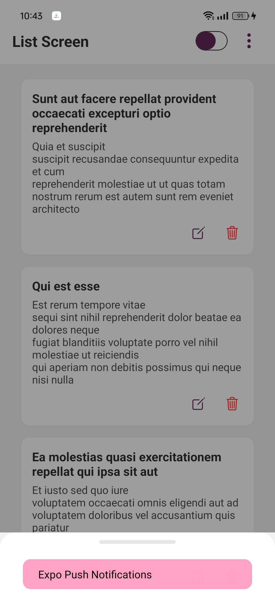
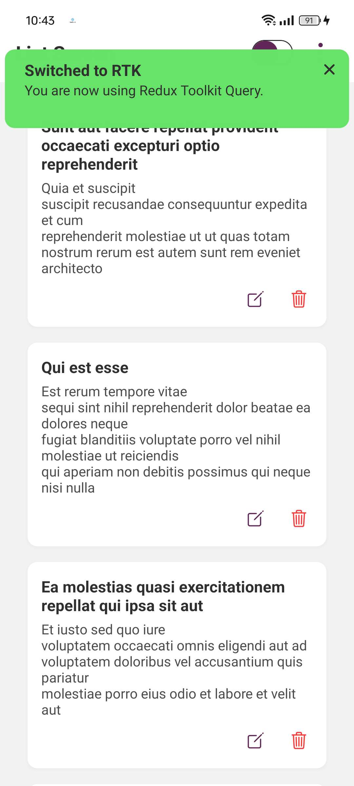
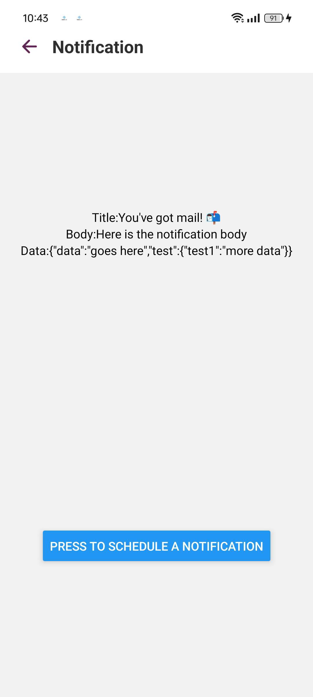
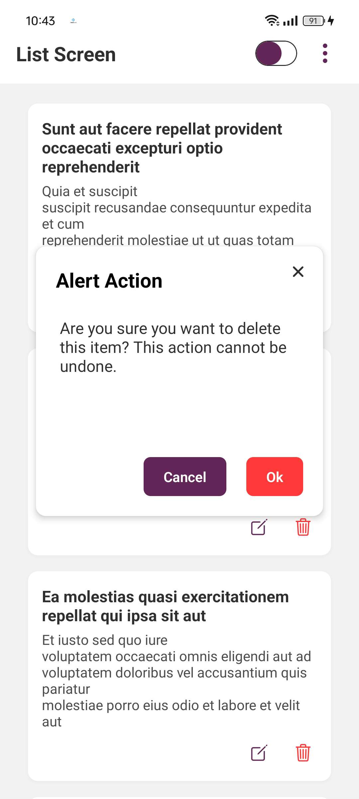
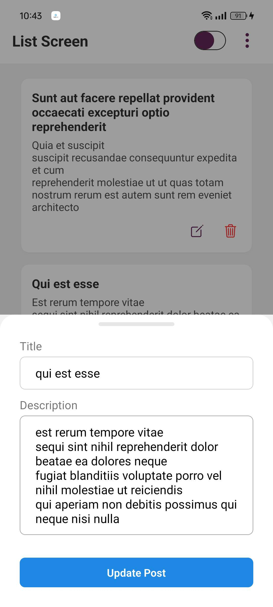
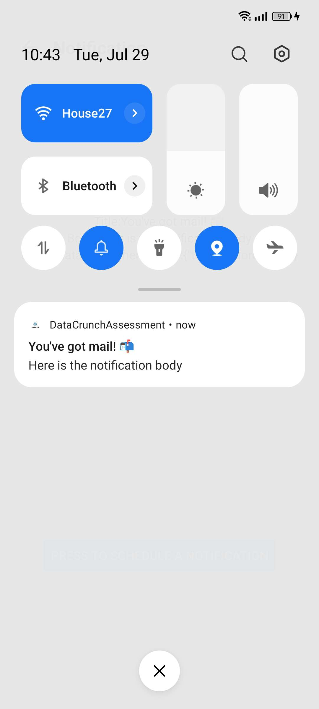

# 📱 DataCrunch App

An Expo React Native app with Expo Push Notifications, RTK Query, and smart feature demos built using Hook Form, Zustand, and more.

---

## ✨ Getting Started

## Demo of screens
<p>









</p>

## Video Demo
**[Watch Demo on youtube](https://youtube.com/shorts/u_7Tu0TYHWY?feature=share)**

### 1. Install Dependencies

```bash
npm install
```

### 2. Run the App on a Physical Device (for notifications)

> ⚠️ **Push Notifications only work on physical devices**

```bash
# Run on Android
npx expo run:android

# Run on iOS
npx expo run:ios
```

---

## 🔔 Push Notifications

Expo Push Notifications are implemented using the `expo-notifications` package.  
To receive notifications:

- Run the app on a **physical device**
- Allow notification permissions when prompted

---

## 🧪 Feature Demo

Navigate to the **Home screen** and tap the **three-dot menu (⋮)** in the top-right corner.  
A bottom sheet will appear with the following demo features:

- **GFetcher Notifications** – test sending and receiving push notifications

Just tap on any option to navigate and test!

---

## 🌐 Data Fetching with RTK Query

The app uses **RTK Query** to fetch a list of data from [JSONPlaceholder](https://jsonplaceholder.typicode.com/).

```ts
GET https://jsonplaceholder.typicode.com/posts
```

Efficient caching, revalidation, and auto-fetching are supported via Redux Toolkit Query.

---
## 🧱 Project Architecture (Clean Architecture)

```
📁 src/
 ┣ 📁 app/                # App entry points and route files
 ┃ ┣ 📄 _layout.tsx
 ┃ ┣ 📄 +not-found.tsx
 ┃ ┣ 📄 index.tsx
 ┃ ┣ 📄 notifications.tsx
 ┣ 📁 core/               # Core dependencies and base utilities
 ┃ ┣ 📁 assets/           # Static assets (icons, images, etc.)
 ┃ ┣ 📁 components/       # Reusable UI components
 ┃ ┣ 📁 constance/        # Constant values and config
 ┃ ┣ 📁 hook/             # Custom React hooks
 ┃ ┣ 📁 rtk/              # Redux Toolkit configuration and slices
 ┃ ┗ 📁 utils/            # Utility/helper functions
 ┃ ┗ 📁 zustand/          # zustand configuration
 ┣ 📁 features/           # Feature-based modules (feature-first structure)
 ┃ ┣ 📁 home/             # Home screen feature
 ┃ ┣ 📁 notifications/    # Push notification feature logic
```

## 🧹 Code Style

This project follows the **Airbnb JavaScript Style Guide**:
- Consistent and modern coding patterns
- Automatic formatting and linting on save

### ✅ Configured Tools:
- ESLint with Airbnb config (`.eslintrc.json`)
- Prettier integration (optional)
- VS Code settings configured for consistency

To enable the same experience:
1. Install ESLint and Prettier extensions in VS Code
2. On save, your code will be linted and formatted automatically

---

## 📬 Need Help?

If you encounter any issues or have questions about notifications or feature demos, feel free to open an issue or reach out.

---

## 📄 License

MIT License
